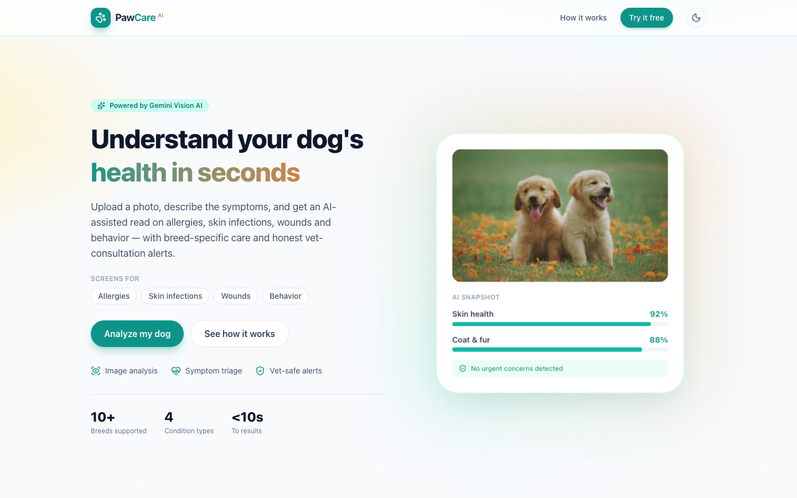
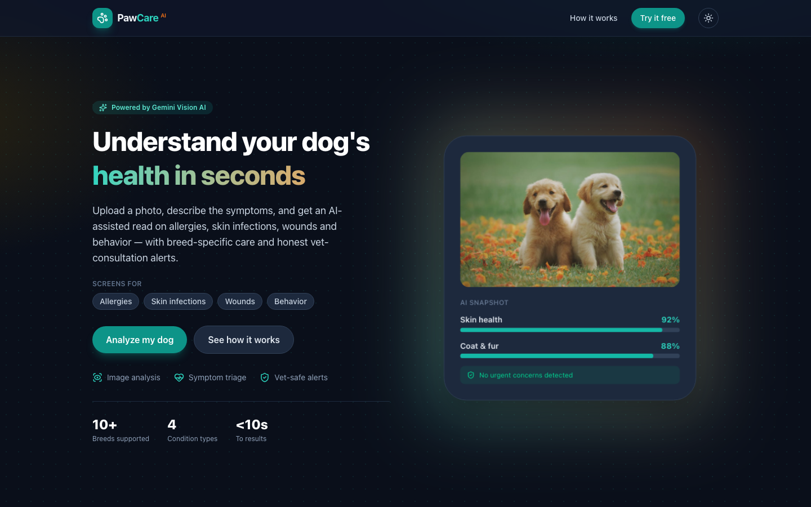
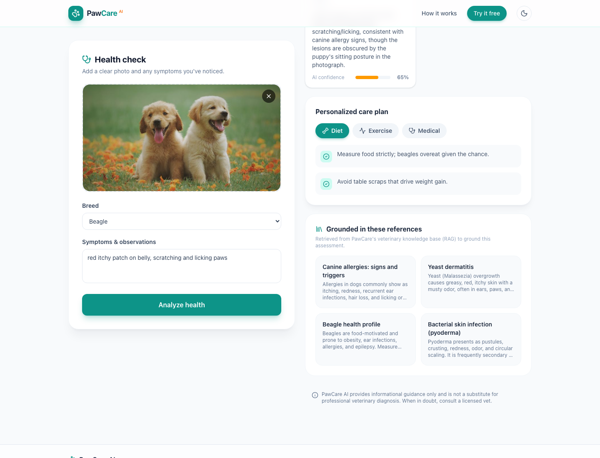

<div align="center">

# 🐾 PawCare AI

### Intelligent Dog Health & Care Assistant

Analyze a photo of your dog, describe the symptoms, and get an AI-assisted read on
**allergies, skin infections, wounds, and behavior** - with **breed-specific care**,
**calibrated confidence scores**, and **honest vet-consultation alerts**.


### 🔗 [**Live Demo**](https://pawcare-ai-psi.vercel.app) &nbsp;·&nbsp; [API Health](https://pawcare-ai-archana-bht2.onrender.com/api/health)

<sub>Frontend on Vercel · Backend on Render (free tier - first request may take ~30–60s to wake).</sub>

</div>

<p align="center">
  
  
</p>

---

## ✨ Overview

PawCare AI is a full-stack platform that helps dog owners monitor their pet's health
from a simple photo and a short symptom description. It combines a **frontier multimodal
vision model** (Gemini or OpenAI) with a **retrieval-augmented (RAG) veterinary knowledge base**,
a **rule-based symptom-triage engine**, and a **breed-specific recommendation engine** -
all wrapped in ethical-AI guardrails that never claim certainty and escalate to a vet
when it matters.

> ⚕️ **Not a diagnostic tool.** PawCare AI provides informational guidance only and is
> never a substitute for a licensed veterinarian.

## 🚀 Key Features

- 🖼️ **Image analysis** - a frontier vision model (Gemini or OpenAI) screens the photo for
  visible signs of allergies, skin infections, wounds, and behavioral cues, returning **structured JSON**.
- 🔀 **Provider-agnostic** - bring any available key (Gemini or OpenAI); the backend
  auto-detects and uses whichever is configured, with a `LLM_PROVIDER` override.
- 🧾 **Symptom evaluation** - a rule-based triage engine interprets owner-reported symptoms
  and escalates emergency keywords.
- 🧬 **Breed-specific recommendations** - tailored diet, exercise, and medical guidance
  across 10+ breeds, with sensible defaults for mixed breeds.
- 📚 **RAG grounding** - a 50+ document veterinary knowledge base is embedded with
  `gemini-embedding-001` and retrieved via **hybrid search** (embedding cosine + keyword,
  blended and re-ranked, with a keyword-only fallback); the top matches ground the
  model's response to reduce hallucination.
- 🛡️ **Ethical-AI guardrails** - calibrated confidence scores, an overall-confidence
  readout, and **vet-consultation alerts** (routine → urgent) that trigger on severe
  findings, emergency keywords, or low confidence.
- 🧼 **Robust image pipeline** - validation, EXIF-orientation, resizing, auto-contrast
  normalization, and quality estimation (brightness/sharpness) for reliable inference.
- 🌗 **Polished UX** - responsive React UI, light/dark themes, drag-and-drop upload,
  animated results, and skeleton loading states.
- 🔌 **Graceful degradation** - works offline in a symptom-only mode when no provider key
  is configured; RAG falls back to keyword retrieval.

## 🧠 How the AI Works

```
  dog photo ─▶  Image pipeline (Pillow): validate · EXIF · resize · auto-contrast · QC
  symptoms ─▶
  breed ────▶  RAG: embed query (gemini-embedding-001) → cosine top-k over vet KB
                    └─ keyword fallback if embeddings unavailable

               Frontier vision - Gemini or OpenAI (structured JSON), grounded in references
                    └─ model-fallback chain on transient 429 / 503

               Symptom triage · breed recommendation engine · confidence aggregation
               Vet-alert guardrails (severity · emergency keywords · low confidence)
                                     │
                                     ▼
               structured result + knowledge-base grounding
```

<p align="center">
  
</p>

## 🏗️ Tech Stack

| Layer     | Technology                                                               |
| --------- | ------------------------------------------------------------------------ |
| Frontend  | React 19, Vite, TypeScript, Tailwind CSS v4, Framer Motion, lucide-react  |
| Backend   | FastAPI, Pydantic, Uvicorn, Pillow                                        |
| AI        | Google Gemini or OpenAI (vision) + `gemini-embedding-001` (RAG embeddings) |
| Retrieval | In-memory cosine similarity over a precomputed vector index              |
| Hosting   | Vercel (frontend) · Render (backend)                                      |

## 📁 Project Structure

```
PawCare/
├── backend/                      FastAPI + Python  ->  Render
│   ├── main.py                   API + endpoints (/api/analyze, /api/health)
│   ├── requirements.txt
│   ├── render.yaml               Render blueprint
│   ├── scripts/
│   │   └── build_kb_embeddings.py  precompute RAG embeddings
│   └── app/
│       ├── config.py             env-based settings
│       ├── schemas.py            Pydantic models (also Gemini output schema)
│       ├── data/
│       │   ├── breeds.py             breed recommendation data
│       │   ├── knowledge_base.py     RAG vet knowledge base (documents)
│       │   └── kb_embeddings.json    precomputed embeddings
│       └── services/
│           ├── preprocessing.py      Pillow image pipeline
│           ├── gemini_service.py     Gemini vision (RAG-grounded, model fallback)
│           ├── rag.py                embed + cosine retrieval (keyword fallback)
│           ├── symptom_engine.py     symptom triage + vet-alert logic
│           └── recommendation_engine.py  breed-specific care + confidence
└── frontend/                     React + Vite + TS + Tailwind v4  ->  Vercel
    ├── vercel.json
    └── src/
        ├── api.ts                typed API client
        ├── types.ts             shared API types
        ├── useTheme.ts          light/dark theme hook
        └── components/          Header · Hero · HowItWorks · UploadPanel · ResultsView
```

## 🧑‍💻 Local Development

### Prerequisites
- Node.js 18+ and npm
- Python 3.11+
- A free Gemini API key from [Google AI Studio](https://aistudio.google.com/app/apikey)

### 1. Backend (FastAPI)

```bash
cd backend
python3 -m venv .venv && source .venv/bin/activate
pip install -r requirements.txt
cp .env.example .env            # then paste your Gemini key into .env
uvicorn main:app --reload --port 8000
```

Without a key the app still runs in symptom-only fallback mode (RAG uses keyword
retrieval). To (re)generate the RAG index after editing the knowledge base:

```bash
python scripts/build_kb_embeddings.py
```

### 2. Frontend (React)

```bash
cd frontend
npm install
cp .env.example .env            # VITE_API_URL=http://localhost:8000
npm run dev                     # open http://localhost:5173
```

## 🔑 Environment Variables

**Backend (`backend/.env`)** - provide **any one** provider key; it auto-detects which to use.

| Variable         | Description                                        | Default               |
| ---------------- | ------------------------------------------------- | --------------------- |
| `GEMINI_API_KEY` | Google AI Studio key (vision + RAG embeddings)    | _(empty)_             |
| `GEMINI_MODEL`   | Gemini vision model                               | `gemini-flash-latest` |
| `OPENAI_API_KEY` | OpenAI key (alternative vision provider)          | _(empty)_             |
| `OPENAI_MODEL`   | OpenAI vision model                               | `gpt-4o-mini`         |
| `LLM_PROVIDER`   | `auto` \| `gemini` \| `openai`                    | `auto`                |
| `CORS_ORIGINS`   | Comma-separated allowed origins                   | localhost dev URLs    |

> With no key set, the app runs in a symptom-only **fallback** mode. `auto` prefers Gemini
> if its key is present, otherwise OpenAI.

**Frontend (`frontend/.env`)**

| Variable       | Description                     | Default                 |
| -------------- | ------------------------------- | ----------------------- |
| `VITE_API_URL` | Base URL of the FastAPI backend | `http://localhost:8000` |

## ☁️ Deployment

**Live deployment:**

| Service  | Platform | URL                                                              |
| -------- | -------- | ---------------------------------------------------------------- |
| Frontend | Vercel   | https://pawcare-ai-psi.vercel.app                                |
| Backend  | Render   | https://pawcare-ai-archana-bht2.onrender.com                     |

Full step-by-step guide: [**DEPLOYMENT.md**](DEPLOYMENT.md).

**In short:**
1. **Backend -> Render** - new Web Service, root `backend`, add `GEMINI_API_KEY`; a
   `render.yaml` blueprint is included.
2. **Frontend -> Vercel** - new project, root `frontend`, set `VITE_API_URL` to the
   Render URL. SPA routing handled by `vercel.json`.

CORS already allows `localhost` and any `*.vercel.app` origin.

## 📡 API Reference

| Method | Endpoint       | Description                                                                       |
| ------ | -------------- | -------------------------------------------------------------------------------- |
| `GET`  | `/api/health`  | Health check (`gemini_enabled`, `rag_documents`)                                 |
| `POST` | `/api/analyze` | `multipart/form-data`: `image` (file), `symptoms`, `breed` -> structured analysis |

**Example response (abridged):**

```json
{
  "is_dog": true,
  "breed": "Beagle",
  "overall_confidence": 0.65,
  "conditions": [
    { "name": "Allergic dermatitis", "category": "allergy", "severity": "mild", "confidence": 0.5 }
  ],
  "recommendations": { "diet": [], "exercise": [], "medical": [] },
  "vet_alert": { "triggered": true, "urgency": "routine", "reasons": [] },
  "sources": [ { "id": "allergy-overview", "title": "Canine allergies: signs and triggers" } ],
  "ai_source": "gemini"
}
```

## ⚖️ Ethical AI

PawCare AI is designed to **support, never replace** professional veterinary care:
- It never claims diagnostic certainty - every finding carries a confidence score.
- It escalates to a vet on severe findings, emergency keywords, or low confidence.
- It rejects non-dog and low-quality images.
- Recommendations are grounded in a curated knowledge base to reduce hallucination.

## 👩‍💻 Author

**Archana Shaji** · [LinkedIn](https://www.linkedin.com/in/archanashaji1311/) · [GitHub](https://github.com/ArchanaShaji1311)

<div align="center"><sub>Built with care for dogs and their humans. 🐕</sub></div>
